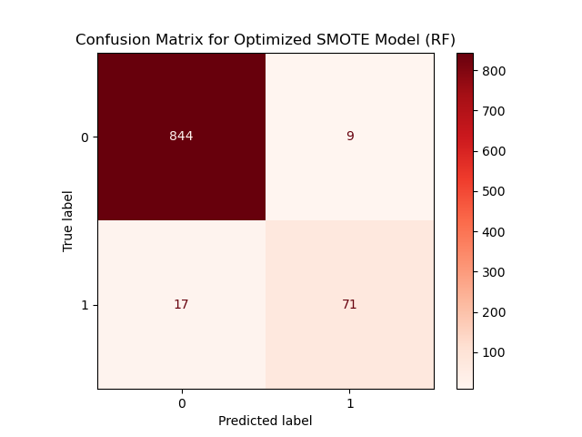
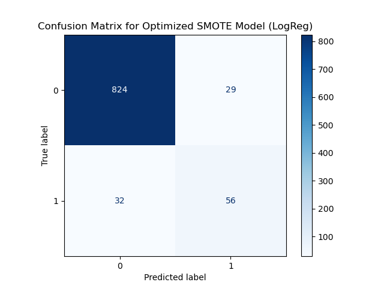
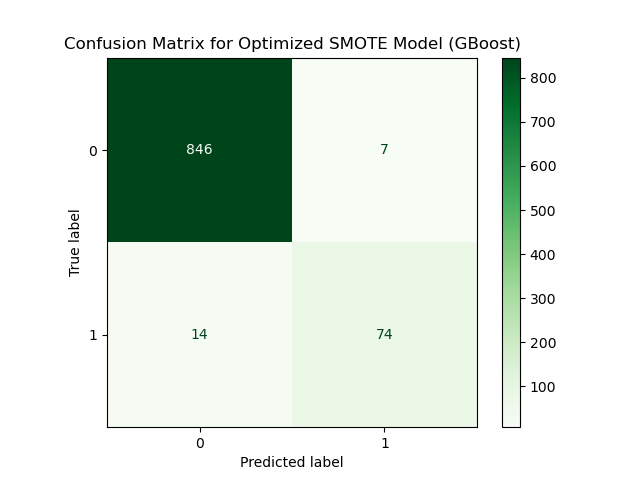
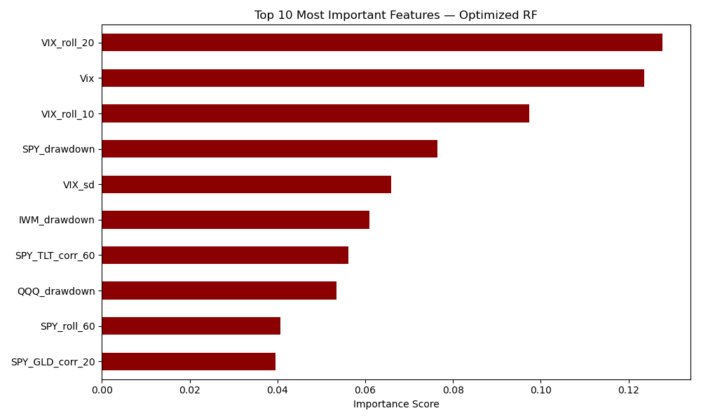
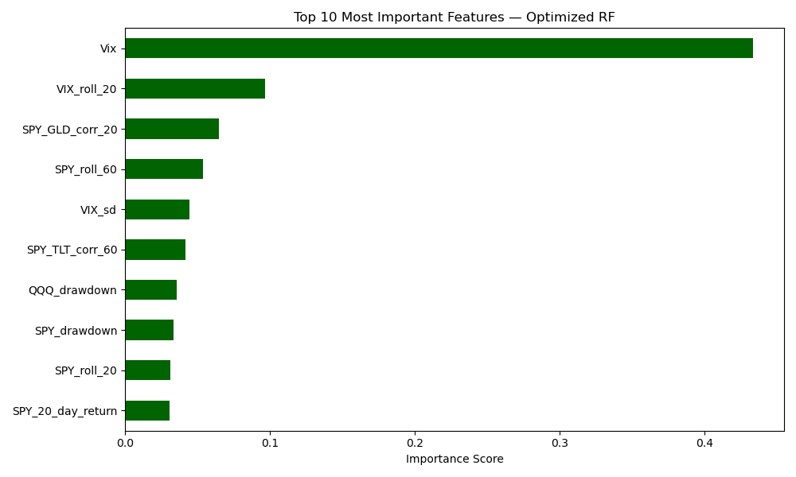
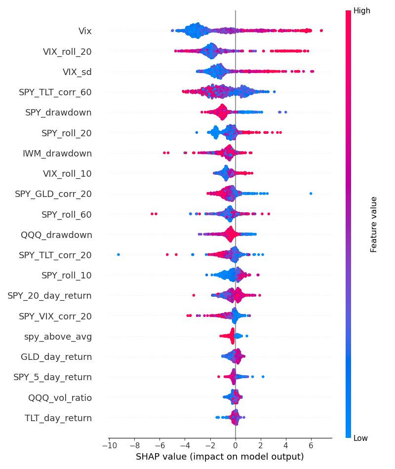

# Supervised Machine Learning

## Research Question

For my project, I wanted to determine if market data can be used to predict whether the market is in crisis. In this portion of my work, I have clearly labeled my target, crisis days, as days where the Volatility Index (VIX) at close, is higher than 30. A VIX score this high indicates that there is extreme volatility in the market, normally caused by outside factors such as the COVID-19 Pandemic. Ultimately, the research question is whether market data can be used to predict 20-days in advance, whether a crisis day will occur.

## Supervised Models

**1. Random Forests** 
**Hyperparameters:** 
- n_estimators (50, 100, 150, 200)
- max_depth (None, 5, 10, 15) 
- min_samples_leaf (1, 3, 5, 7)
**Validation:** 
- Train-test split of 80/20
- cross validation with 5 folds
- OOB score
**Performance Metrics:** 
- Chosen Parameters: max_depth None, min_samples_leaf 3, n_estimators 200
- Majority Class F1-score: 0.98
- Minority Class F1-score: 0.85
- Train Accuracy: 0.9977, Test Accuracy: 0.9724, OOB Score: 0.9845
- Minority Class: Recall 0.81, Precision 0.89
- Majority Class: Recall 0.98, Precision 0.99

**2. Logistic Regression**
**Hyperparameters**
- Learning Rate (C) (0.01, 0.1, 1, 10, 100)
- penalty (l1, l2)
- solver (liblinear, saga)
**Validation:** 
- Train Test Split of 80/20
- Precision-Recall Tradeoff
- cross validation with 5 folds
**Perfomance Metrics:** 
- Chosen Parameters: C 0.1, penalty 'l1', solver 'saga'
- Majority Class F1-score: 0.96
- Minority Class F1-score: 0.65
- Train Accuracy: 0.8475, Test Accuracy: 0.8714
- Minority Class: Recall 0.66, Precision 0.64
- Majority Class: Recall 0.96, Precision 0.97

**3. Gradient Boosting**
**Hyperparameters**
- learning_rate (0.01, 0.1, 0.2)
- max_depth (3, 5, 10)
- min_samples_leaf (3, 5)
- n_estimators (100, 200)
**Validation:** 
- Train-test split of 80/20
- cross validation with 5 folds
**Perfomance Metrics:** 
- Chosen Parameters: learning_rate 0.1, max_depth 10, min_samples_leaf 5, n_estimators 200
- Majority Class F1-score: 0.99
- Minority Class F1-score: 0.88
- Train Accuracy: 1.0, Test Accuracy: 0.9777
- Minority Class: Recall 0.84, Precision 0.91
- Majority Class: Recall 0.99, Precision 0.98

## Model Comparison and Selection

**Trends:** As I expected, VIX features were extremely important in predicting whether the VIX score 20 days in the future would exceed 30 or not. Most of the top 10 features between the optimal Random Forest model and the optimal Gradient Boosting model are similar, however the order and level of significance differ. The Random Forest model puts more importance across all of the top features, where as the Gradient Boosting model relies mostly on the top feature and less on other features. 

**Performance:** Both, the Random Forest and Gradient Boosting models performed reasonably well, while the logistic regression model did not perform well regardless of hyperparameterization. The Gradient Boosting model perfomed best across all performance metrics, with a higher test accuracy, higher minority class precision, and higher minority class recall. Gradient Boosting performs better at capturing model complexity, including interactions, and managing bias and variance at every iteration of the model.

**Challenges:** Across all models, class imbalance proved very challenging. Balancing the weight classes proved to be an ineffective solution to this problem, therefore SMOTE was used to create better balance between the majority and minority classes. Another challenge was managing the hyperparameter tuning. Due to high complexity costs, it is not reasonable to truly test model performance across a wide variety of model variations. 

## Explainability

**Random Forest Features:**

For the Random Forest Model, the 20 day rolling mean for the VIX close score was most influential, closely followed by the total VIX score at close. 

**Gradient Boosting Features:**

For the Gradient Boosting Model the VIX at close value was the most influential feature in the model. The second most important feature was the 20 day rolling mean VIX close score, followed by a 20 day correlation between the SPY stock index and Gold prices at close. Looking at the SHAP plot, it can be concluded that a high feature score for VIX is strongly indicative of a future crisis day, while a low feature score for VIX is strongly indicative for a future normal day. 

## Final Takeaways

**Key Insights:** Through supervised learning, I discovered that Machine Learning is a feasible solution to answering my research question. Models that handle multicollinearity, and handle non-linearity and model complexity well, are viable options for predicting future market volatilty (crisis = 1, normal = 0), at a reasonable accuracy. Through analysis of my data, I determined that current market volatility can be used as a highly predictive feature for future market volatility, when paired with other market features such as correlations between the SPY index and other important market performance indicators.

