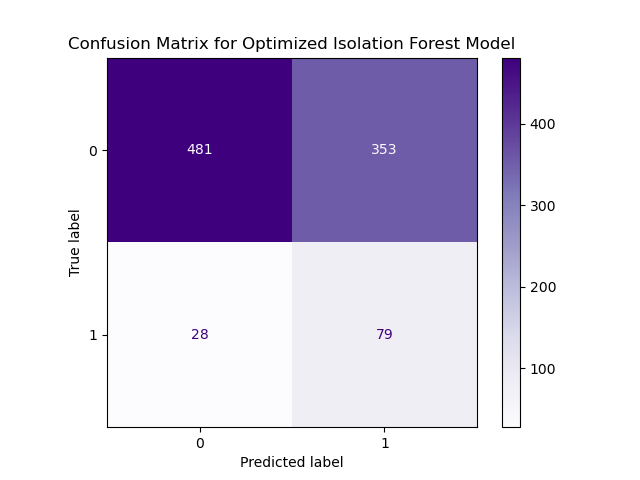
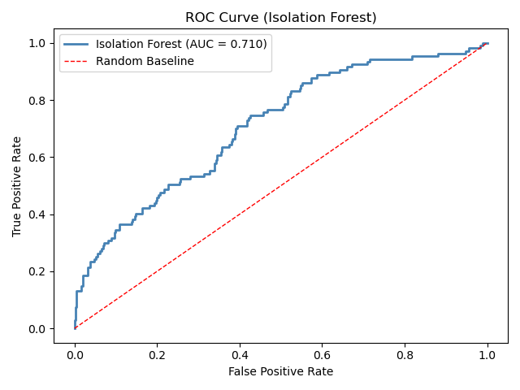
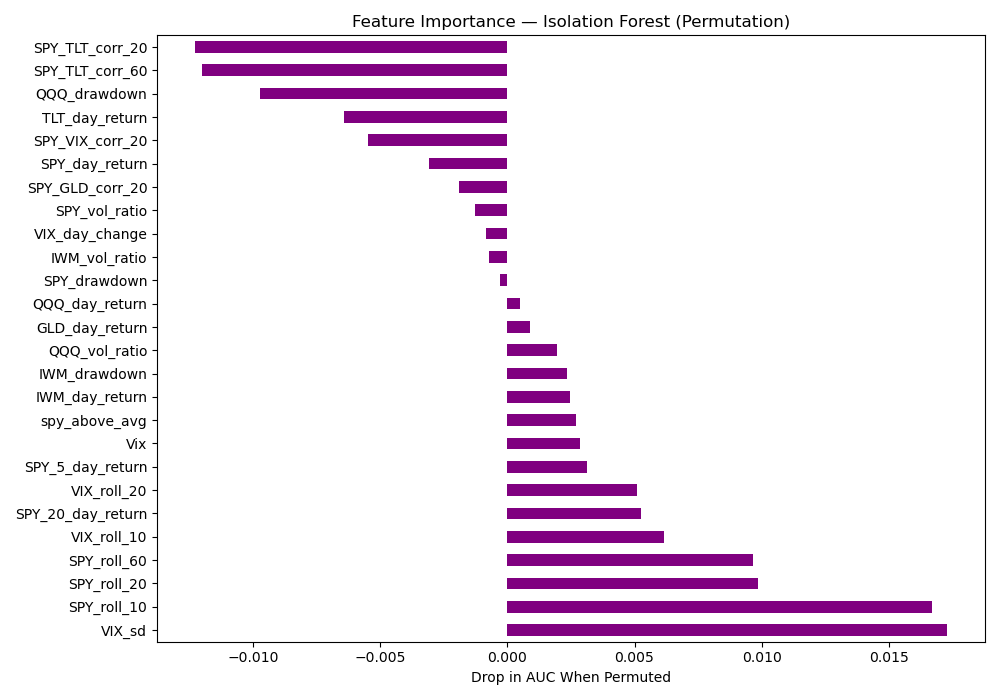
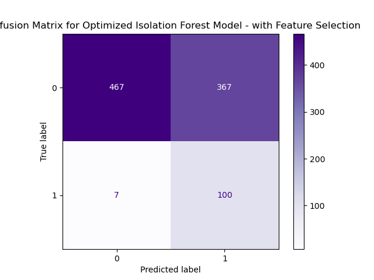
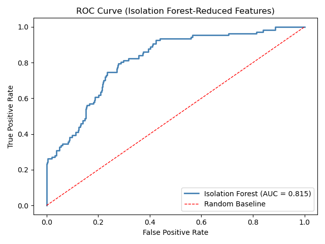
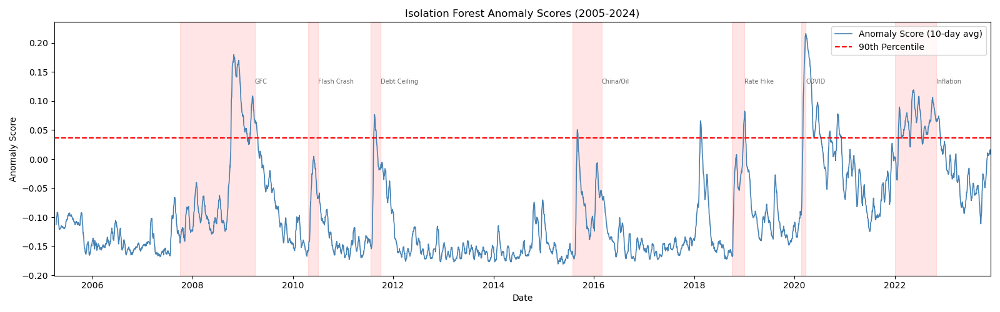

# Unsupervised Machine Learning Method

## Research Question

For my project, I wanted to determine if market data can be used to predict whether the market is in crisis. In this portion of my work, I apply an anomaly detection model, Isolation Forest, in order to determine how anomaly detection without a clearly defined label compares to the target label used in my supervised models (VIX at close > 30). 

## Model: Isolation Forest

### Baseline Model:

**Hyperparameters:**  

- contamination 0.09
- max_features 1.0
- max_samples 'auto'
- n_estimators 100

**Validation:**  

- Train-test split of 80/20

**Performance Metrics:**  

- ROC-AUC score: 0.746
- Macro average F1 score: 0.51
- Weighted average F1 score: 0.67

### Optimized Model - Without Feature Importance:

**Hyperparameters:**  

- contamination 0.07
- max_features 0.75
- max_samples 125
- n_estimators 300

**Validation:**

- Train-test split of 80/20
- For loop to iterate through hyperparameters

**Performance Metrics:**

- ROC-AUC score: 0.752
- Macro average F1 score: 0.54
- Weighted average F1 score: 0.71

### Optimized Model - With Feature Importance:

After evaluating changes in AUC score with permutations of the model. Only features with positive values were selected for a reduced optimized model. This reduced model performed considerably better than the optimized model with all features present. 

**Hyperparameters:**  

- contamination 0.07
- max_features 0.75
- max_samples 256
- n_estimators 100

**Validation:**

- Train-test split of 80/20
- For loop to iterate through hyperparameters

**Performance Metrics:**

- ROC-AUC score: 0.815
- Macro average F1 score: 0.75
- Weighted average F1 score: 0.60

## Analysis

After feature selection based on feature importances, and optimization of hyperparameters, the isolation forest model improved significantly. The final model still struggles when compared to the defined target label used in the supervised models. However, the model reported a high ROC-AUC score of 0.815, meaning that when the model is given a normal day and a crisis day, it will correctly assign the higher anomaly score to the crisis day 81.5% of the time.

The graph above compares the assigned anomaly scores between the years 2005-2024. The red shaded areas mark periods of time that were historically reported as significant market crashes. By looking at this graph we can see that, despite the Isolation Forest not performing as well at predicting crashes based on the target label, the model does appear to capture market crashes relatively well.

## Key Findings

The Isolation Forest model demonstrated a reasonable ability to detect active market crashes without the use of any labeled data during training. The model's ROC-AUC score of 0.815 suggests that genuine statistical anomalies exist during periods of market stress, and that these anomalies are detectable through unsupervised methods alone.

Interestingly, correlation between market features actively hurt the performance of the Isolation Forest, whereas they improved performance in supervised modeling. This suggests that while shifts in correlation are useful for predicting future market crashes, they are a poor indicator of crashes that are actively occurring. During periods of market stress, correlations tend to behave erratically, reducing their value as a real-time anomaly signal. Short-term momentum and volatility dispersion features, such as SPY_roll_10 and VIX_sd, proved to be the strongest unsupervised signals of an active market crisis.